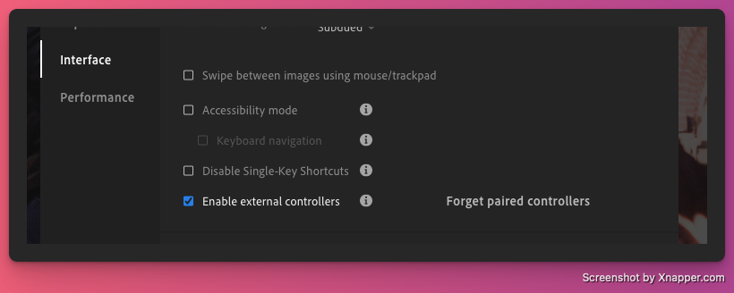

# Lightroom Loupedeck Plugin

A comprehensive Loupedeck plugin for Adobe Lightroom that provides direct control over photo adjustments, ratings, and workflow operations via WebSocket communication.
I did this mostly for personal purposes, decided to share - maybe someone will find it useful.

⚠️ I have tested it on Mac only, don't have option to try it using Windows - if you manage to make it work there, please let me know.

## Requirements:
Adobe Lightroom installed, with `Enable external controllers` setting enabled:



After installing, there is a default profile with buttons and knobs assigned to actions, with some icons and labels.
However, I feel that workflow is personal choice, so this is my favourite setup - for you it will probably be different so feel free to rearange.
With implemented actions - you should be able to setup desidred flow - there are adjustments with configurable step (for micro movements). Setting value allows you to create shortcuts to reset values or setting at some desired level. There is not so many colorgrading options yet, but they will be added over time. 

If you find this plugin valuable, feel free to buy me a beer ;) - https://buymeacoffee.com/spaceboy83

## Features

### Light Adjustments
- 🎛️ **Exposure** - Adjust overall brightness with configurable step values (0.01-5.0)
- 🎛️ **Highlights** - Adjust bright areas
- 🎛️ **Shadows** - Control dark areas
- 🎛️ **Blacks** - Adjust black tones
- 🎛️ **Contrast** - Modify tonal contrast

### Tint/Color Adjustments
- 🎛️ **Temperature** - Adjust color temperature (warm/cool)
- 🎛️ **Tint** - Control green-magenta balance
- 🎛️ **Vibrance** - Subtle saturation adjustment
- 🎛️ **Saturation** - Overall color intensity control

### Effects
- 🎛️ **Texture** - Adjust fine detail and texture
- 🎛️ **Clarity** - Midtone contrast enhancement
- 🎛️ **Dehaze** - Remove atmospheric haze

### Perspective Controls
- 🎛️ **Rotate** - Rotate perspective correction
- 🎛️ **Aspect** - Adjust aspect ratio
- 🎛️ **Scale** - Scale perspective
- 🎛️ **Vertical** - Vertical perspective correction
- 🎛️ **Horizontal** - Horizontal perspective correction
- 🎛️ **X Offset** - Horizontal position adjustment
- 🎛️ **Y Offset** - Vertical position adjustment
- 🎛️ **Upright** - Automatic upright correction

### Optics
- ▶️ **Remove Chromatic Aberration** - Toggle CA removal (0/1)
- ▶️ **Enable Lens Corrections** - Toggle lens profile corrections (0/1)

### Flagging & Rating
- ▶️ **Flag as Picked** - Mark photo as picked
- ▶️ **Flag as Rejected** - Mark photo as rejected
- ▶️ **Remove Flag** - Clear flag status
- ▶️ **Rate 0-5** - Set star rating (0-5 stars)

### Color Labels
> **Note:** Color label commands require Adobe Lightroom Classic 9.0 or above

- ▶️ **Color: Red** - Set color label to red
- ▶️ **Color: Yellow** - Set color label to yellow
- ▶️ **Color: Green** - Set color label to green
- ▶️ **Color: Blue** - Set color label to blue
- ▶️ **Color: Purple** - Set color label to purple
- ▶️ **Color: None** - Remove color label

### General
- ▶️ **Set Value** - Set any Lightroom parameter to a specific value via dropdown selection
- ▶️ **Configure Connection** - Set WebSocket host and port
- ▶️ **Show Connection** - Display current connection status

## Configurable Parameters

### Adjustment Step Values
All knob-based adjustments support configurable step values:
- **Range**: 0.01 to 5.0
- **Default**: 0.1
- **Precision**: 2 decimal places
- Configured per-action via slider in Loupedeck UI

### WebSocket Connection
- **Host**: IP address or hostname (default: 127.0.0.1)
- **Port**: Port number (default: 7682)
- Configurable via "Configure Connection" command in Settings group

## Requirements

- **Loupedeck Device**: Loupedeck Live, Loupedeck CT, or Loupedeck +
- **Adobe Lightroom Classic**: With External Controller API enabled
- **.NET SDK**: Version 8.0 or later (for building)
- **Operating System**: Windows or macOS

## Installation

### Option 1: Pre-built Package (Recommended)

1. Download the latest release from the releases page
2. Double-click the `.lplug4` file
3. Loupedeck software will automatically install the plugin
4. Restart Loupedeck software if necessary

### Option 2: Build from Source

See [Build Instructions](#build-instructions) below.

## Build Instructions

### Prerequisites

1. Install .NET SDK 8.0 or later
   ```bash
   # Verify installation
   dotnet --version
   ```

2. Clone or download this repository
   ```bash
   git clone <repository-url>
   cd LightroomPlugin
   ```

### Building the Plugin

#### macOS/Linux
```bash
cd src
dotnet build --configuration Debug
```

#### Windows
```cmd
cd src
dotnet build --configuration Debug
```

The built plugin will be located at:
- Debug: `bin/Debug/`
- Release: `bin/Release/` (if building with `--configuration Release`)

### Installing the Built Plugin

1. The build process automatically creates a plugin link:
   - **macOS**: `~/Library/Application Support/Logi/LogiPluginService/Plugins/LightroomPlugin.link`
   - **Windows**: `%APPDATA%\Logi\LogiPluginService\Plugins\LightroomPlugin.link`

2. Restart the Loupedeck software:
   - **macOS**: `killall Dock` or restart the Loupedeck application
   - **Windows**: Restart the Loupedeck application

### Creating a Distribution Package

To create a `.lplug4` package for distribution:

```bash
cd src
dotnet build --configuration Release
cd bin/Release
# The .lplug4 file is automatically created in the bin directory
```

### Adding Actions to Loupedeck

1. Open Loupedeck software
2. Enter edit mode for your device
3. Search for "Lightroom" in the action picker
4. Drag desired actions to buttons or dials:
   - **Buttons**: Use for commands (rating, flagging, optics, set value)
   - **Dials**: Use for adjustments (exposure, contrast, temperature, etc.)

### Configuring Adjustment Steps

For each adjustment action (exposure, whites, etc.):
1. Add the action to a dial
2. Configure the step value via the slider (0.01-5.0)
3. The action name will update to show the current step value

## Development

### Adding New Actions

1. Create a new class in the appropriate `Actions/` subfolder
2. Inherit from `ActionEditorAdjustment` (for dials) or `ActionEditorCommand` (for buttons)
3. Implement required methods
4. Create corresponding SVG icon in `package/actionsymbols/` and `package/actionicons/`
5. Rebuild the plugin

### WebSocket Communication

The plugin uses `LightroomWebSocketClient` for all Lightroom communication:
- `IncrementParameterAsync(parameter, amount)` - Increase parameter value
- `DecrementParameterAsync(parameter, amount)` - Decrease parameter value
- `SetValueAsync(parameter, value)` - Set parameter to specific value
- `SendCommandAsync(command)` - Send command (e.g., flagging, rating)

## License

This project is licensed under the MIT License - see the LICENSE file for details.

## Acknowledgments

- Built using the Loupedeck Plugin SDK
- Communicates with Adobe Lightroom Classic via External Controller API
- Icon design follows Loupedeck guidelines for optimal visibility

## Support

For issues, questions, or contributions, please open an issue on the project repository.

## Version History

### v1.0.0
- Initial release
- 40 actions across 9 categories
- Full WebSocket communication with Lightroom
- Configurable adjustment step values
- Connection configuration UI
- Complete action icon set
- Color label support (requires Lightroom Classic 9.0+)

